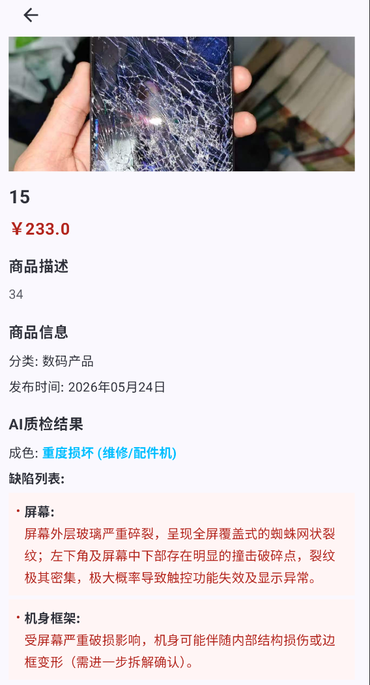

校易是一款基于前后端分离架构的校园二手交易平台，旨在为在校学生提供安全、便捷的二手物品交易服务。平台集成了 AI智能质检 功能，通过智谱AI对商品图片进行质量检测，帮助用户了解商品状况
技术栈：
前端（android）
- 语言 ：Kotlin
- UI框架 ：Jetpack Compose
- 架构模式 ：MVVM
- 状态管理 ：StateFlow
- 网络请求 ：Retrofit
- 本地数据库 ：Room
  后端（spring boot）
- 语言 ：Java 17
- 框架 ：Spring Boot
- 安全框架 ：Spring Security + JWT
- ORM框架 ：MyBatis-Plus
- 数据库 ：MySQL
  AI 服务
- 智谱AI ：GLM-5V-Turbo 模型
  项目结构：
  XiaoYi/
  ├── app/                          # Android前端
  │   ├── src/main/java/com/example/xiaoyi/
  │   │   ├── api/                  # Retrofit接口定义
  │   │   ├── config/               # 配置类
  │   │   ├── model/                # 业务模型
  │   │   ├── repository/           # 数据仓库
  │   │   ├── ui/                   # UI组件
  │   │   │   ├── components/       # 通用组件
  │   │   │   └── screens/          # 页面屏幕
  │   │   ├── utils/                # 工具类
  │   │   ├── viewModel/            # ViewModel层
  │   │   └── MainActivity.kt       # 主入口
  ├── demo/                         # Spring Boot后端
  │   ├── src/main/java/com/example/android/
  │   │   ├── controller/           # 控制器
  │   │   ├── service/              # 服务层
  │   │   ├── repository/           # 数据访问层
  │   │   ├── entity/               # 实体类
  │   │   ├── utils/                # 工具类
  │   │   └── Application.java      # 启动类
  │   └── src/main/resources/
  │       └── application.yml       # 配置文件
  核心功能：
- 智能商品发布 ：用户拍照后，AI自动分析图片成色，识别划痕、磕碰位置，辅助卖家填写描述。
- 极致流畅体验 ：利用自定义线程池将AI解析任务移至子线程，主线程仅处理UI渲染， 发布响应速度提升60%，杜绝界面卡顿 。

